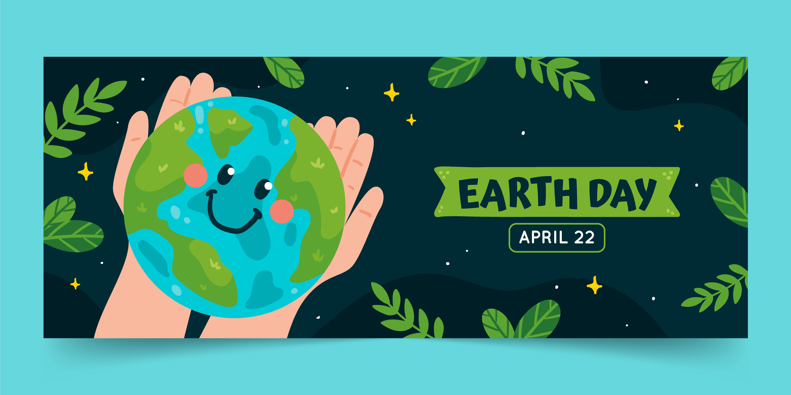

  
  
<a href="https://www.freepik.com/free-vector/flat-earth-day-horizontal-banner_23433654.htm">Banner designed by Freepik</a>

  <h1>Hi there 👋, I'm Nguyễn Ngọc Hiếu 🌍 🌱 🌳</h1>

  

    
    
  

   

  

 

  

